# IT Helpdesk Portfolio: AI Triage + Active Directory + Network Lab

**Author:** Ulrich (Rich) Fondjo
**Project type:** IT Support home lab / portfolio project
**Stack:** VirtualBox, Ubuntu Server, osTicket, Windows Server 2022 + Active Directory, Python, Claude API, Cisco Packet Tracer

## Overview

This repo documents a full IT support lab built from scratch: a real helpdesk ticketing system, a Windows Active Directory domain, a Python script that uses the Claude API to auto-triage incoming tickets, and a network troubleshooting lab in Cisco Packet Tracer. The goal is to demonstrate the exact day-to-day skills a Tier 1 / Tier 2 helpdesk role requires — ticketing, account administration, and basic network troubleshooting — plus a modern AI-assisted workflow layered on top.

One project constraint worth calling out: the build runs on an Apple Silicon (M1) Mac, so the Windows Server / Active Directory phase can't run locally in VirtualBox and is instead built on a remote/cloud VM (Azure), accessed from this same Mac via Remote Desktop.

## Progress

| Phase | What It Covers | Status |
|---|---|---|
| 1 | VirtualBox + Ubuntu Server VM | ✅ Complete |
| 2 | osTicket helpdesk install | ✅ Complete |
| 3 | Active Directory domain (Windows Server 2022) | ✅ Complete |
| 4 | AI ticket triage with the Claude API | ✅ Complete |
| 5 | 10 realistic tickets, created & resolved (incl. AD tickets) | 🔲 Not started |
| 6 | Full portfolio case study document | 🔲 In progress (Phases 1–2 documented so far) |
| 7 | Network troubleshooting lab (Cisco Packet Tracer) | 🔲 Not started |

---

## Phase 1 — VirtualBox + Ubuntu Server

Built a Ubuntu Server 24.10 (ARM64) virtual machine in VirtualBox to host the helpdesk software — isolated from the host Mac, with 2 vCPUs and 2GB RAM.

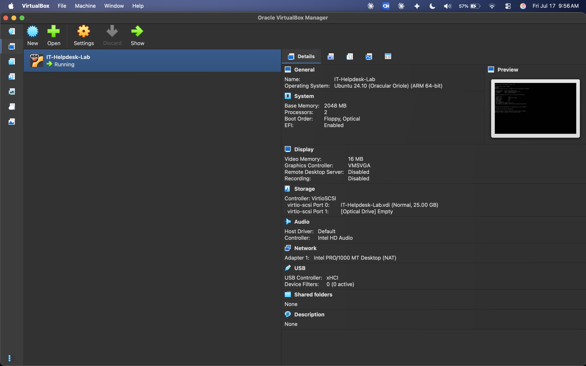

## Phase 2 — osTicket Helpdesk Install

Installed a full LAMP stack (Apache, MySQL, PHP) on the Ubuntu VM, then downloaded, configured, and secured **osTicket** — an open-source helpdesk ticketing system used by real companies — exactly the way an IT admin would in production (locking down config file permissions and removing the setup directory after install).

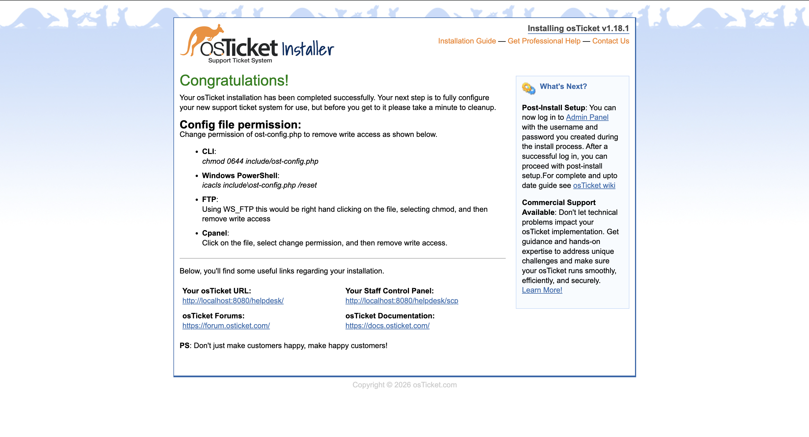

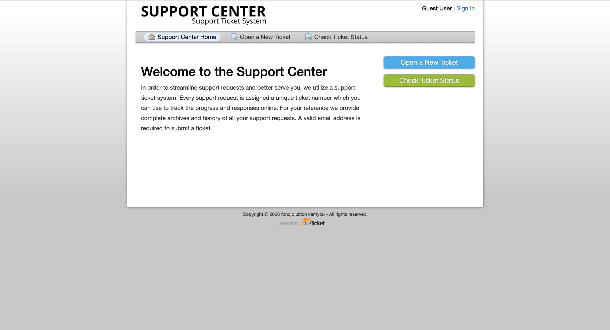

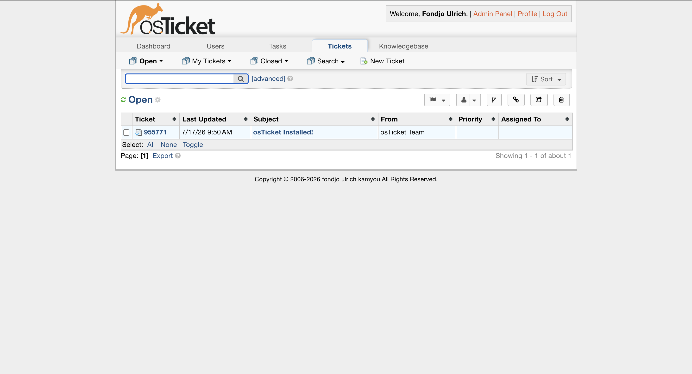

### Problems hit & fixed

- **SSH wasn't reachable** — the SSH service wasn't enabled by default; fixed with `systemctl enable`.
- **osTicket installer failed on a database error** — traced through the Apache error log to a MySQL access-denied error. Root cause: the database password contained a `!`, which bash interprets as a history-expansion character, silently mangling the password before MySQL ever saw it. Reset the password to avoid special characters, verified the DB login manually, and the install completed cleanly.

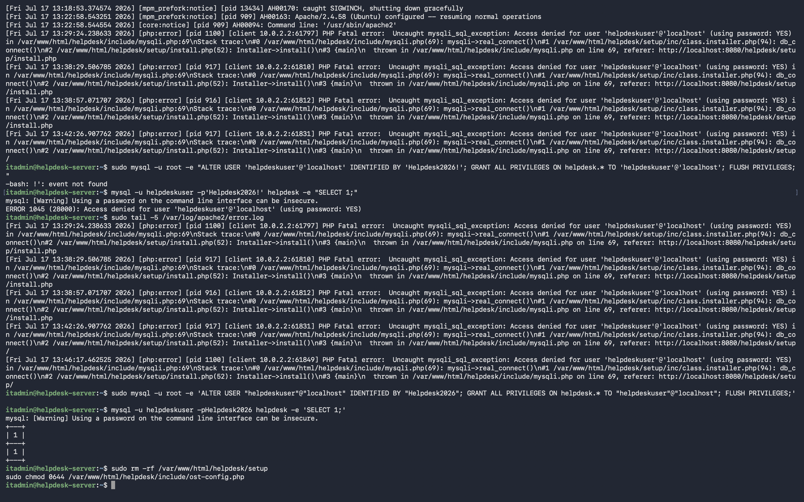

## Phase 3 — Active Directory Domain

Apple Silicon Macs can't run Windows Server locally in VirtualBox (x86_64 guests only run through unsupported, very slow emulation), so this phase runs on a **Windows Server 2022 VM in Azure** instead (free trial, $200/30-day credit), connected to from the Mac via Microsoft Remote Desktop. Everything else — every AD DS step, OU, group, and Tier 1 task — is identical to a local build, just performed over RDP.

**What was built:** a domain controller (`DC01`) promoted to run a new forest, `ukfsupport.local`, with 4 Organizational Units, 4 security groups, and 10 employee accounts — the same structure a small company runs.

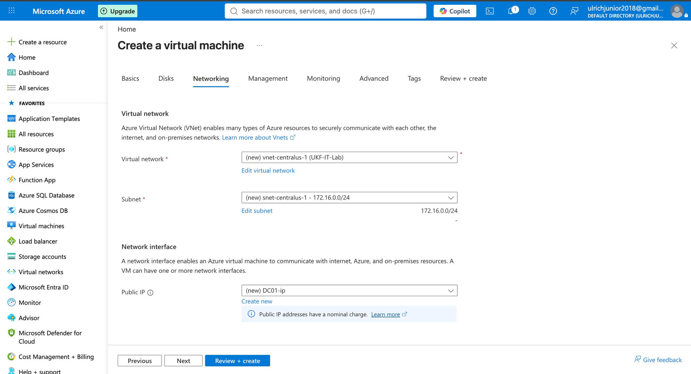

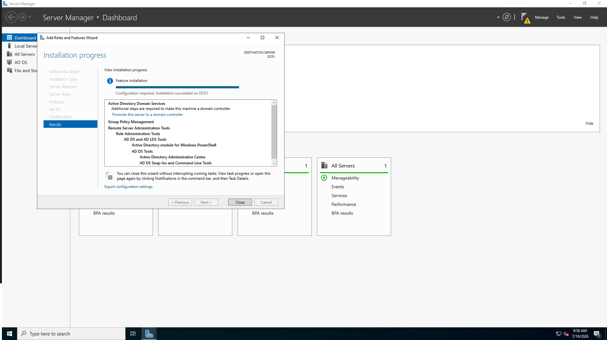

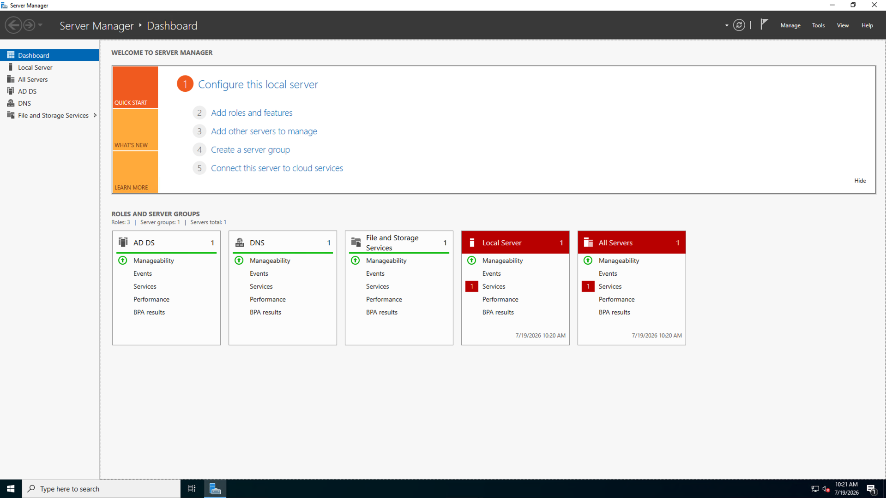

### Organizational Units & Security Groups

Built out 4 OUs (Management, Sales, IT, Operations) and 4 security groups (Managers, Sales-Team, IT-Admins, All-Staff), then created 10 employee accounts spread across departments, each added to their department group plus All-Staff.

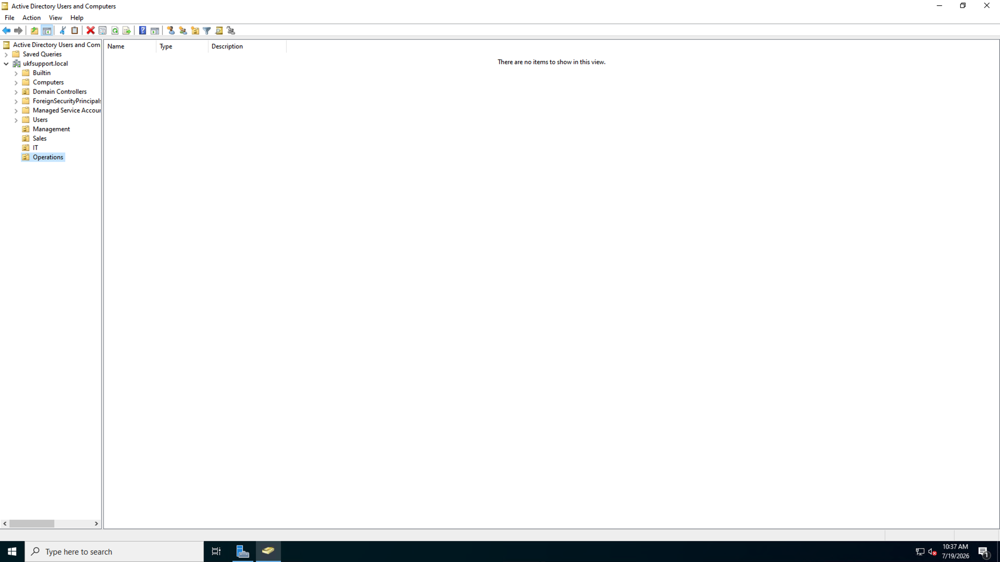

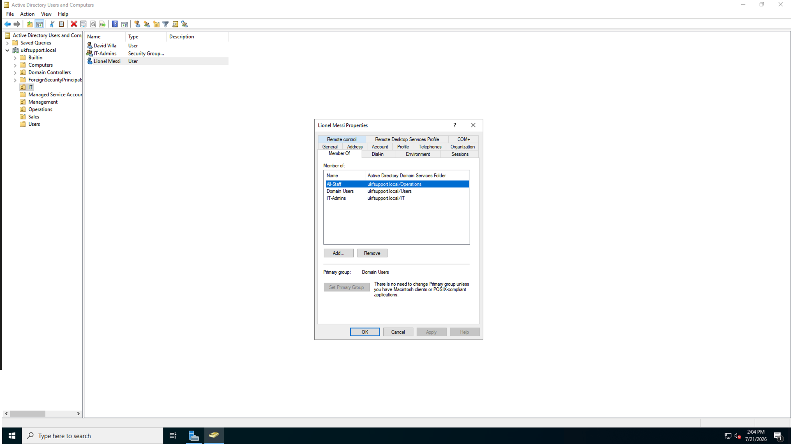

### The 4 Daily Tier 1 Tasks

These are the bread-and-butter tickets a real helpdesk handles constantly — genuinely performed against the live domain, not simulated.

**Task A — Password reset**

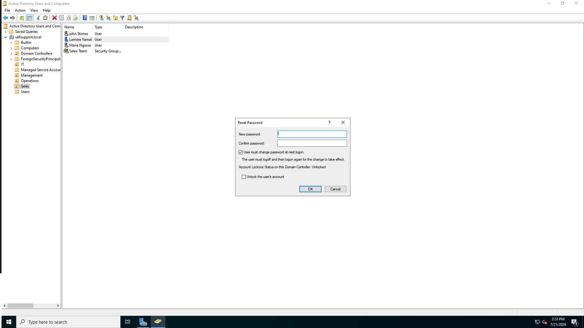
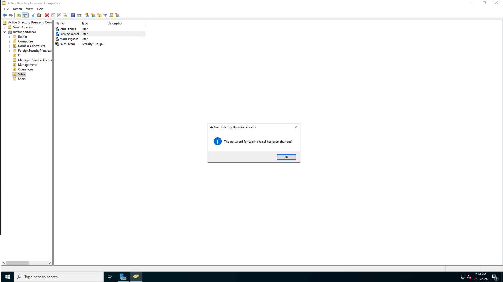

**Task B — Unlock an account**

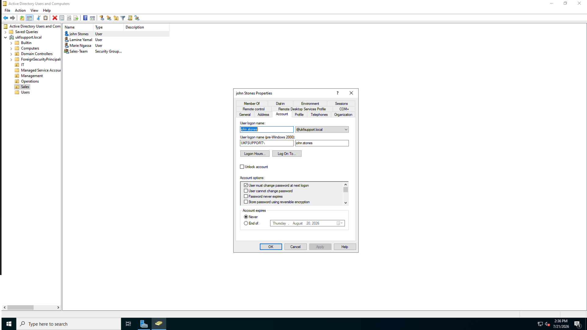

**Task C — Disable a leaver** (never delete — preserves the audit trail)

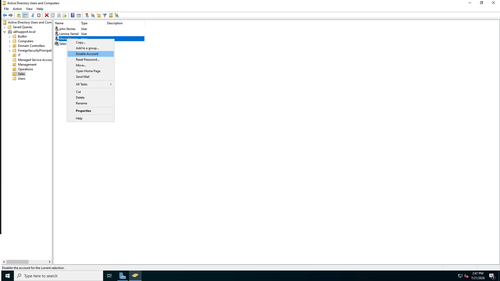


**Task D — Group access request** — added a user to a department security group to grant shared-folder access (same mechanism shown in the Member Of screenshot above).

### Bonus: PowerShell administration

Real sysadmins script this instead of clicking through the GUI. Ran the same password-reset-and-unlock workflow via PowerShell:

```powershell
Set-ADAccountPassword -Identity Rich.man -Reset -NewPassword (ConvertTo-SecureString 'NewPass2026!' -AsPlainText -Force)
Unlock-ADAccount -Identity Rich.man
```

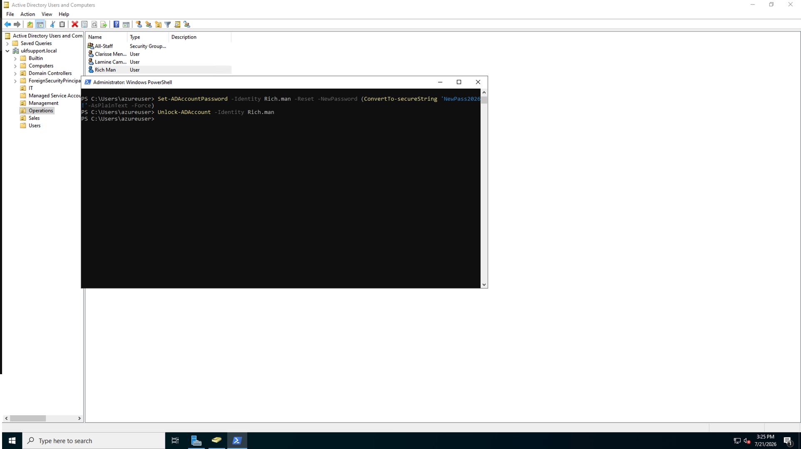

### Problems hit & fixed

- **RDP login failed after domain promotion** — after promoting DC01 to a domain controller, the local `azureuser` account became a *domain* account, so the old plain username no longer authenticated. Fixed by logging in with the domain-qualified form: `UKFSUPPORT\azureuser`.

  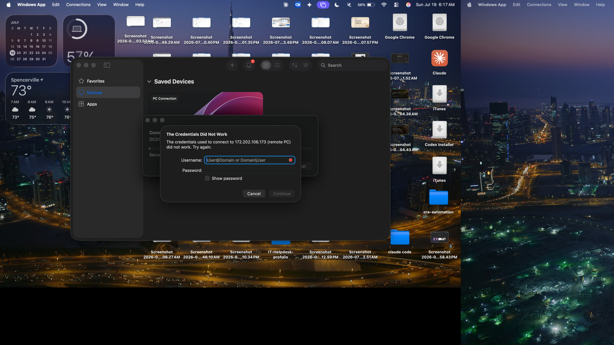

- **PowerShell command failed with a parameter-binding error** — pasted two commands at once and they merged onto a single line, so `Set-ADAccountPassword` saw the `-Identity` parameter twice. Fixed by running each command separately, one paste + Enter at a time.

  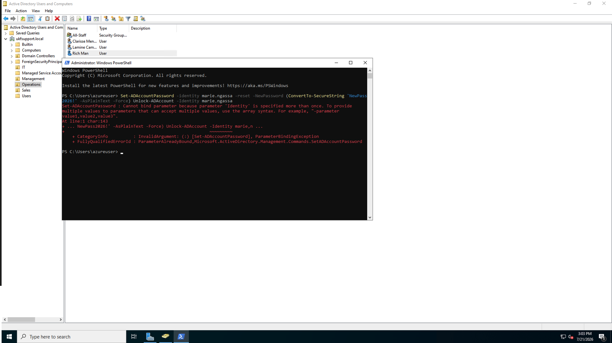

## Phase 4 — AI Ticket Triage (Claude API)

Wrote a Python script (`triage.py`) that sends incoming ticket text to Claude and gets back a structured classification: category, priority, a one-line reason, and a suggested first response — the same kind of auto-triage layer modern support tools use before a human agent looks at a ticket.

```python
def triage_ticket(ticket_text):
    prompt = f'''You are an IT support triage system.
Analyze this support ticket and respond ONLY in this exact format:
CATEGORY: [Hardware/Software/Network/Account/Other]
PRIORITY: [Critical/High/Medium/Low]
REASON: [One sentence]
SUGGESTED_RESPONSE: [Professional reply to user]

Ticket: {ticket_text}'''

    message = client.messages.create(
        model='claude-sonnet-5',
        max_tokens=500,
        messages=[{'role': 'user', 'content': prompt}]
    )
    for block in message.content:
        if block.type == 'text':
            return block.text
    return '(no text response)'
```

Full script: [`triage.py`](triage.py)

Tested against 6 sample tickets spanning hardware, account/AD, network, and software issues. Sample result:

```
TICKET: My account is locked out after too many password attempts
CATEGORY: Account
PRIORITY: High
REASON: The user is completely unable to access their account, which blocks all work activity until resolved.
SUGGESTED_RESPONSE: Thank you for reaching out. I understand your account has been locked due to
multiple failed login attempts. I will initiate an account unlock and password reset process for you
right away...
```

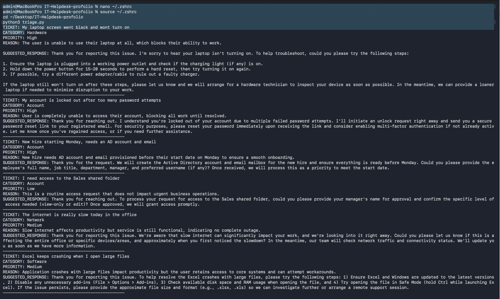

## Phase 5 — Ticket Log *(not started)*

Plan: submit 10 realistic tickets into osTicket spanning Critical → Low priority, run each through `triage.py`, and resolve them with professional notes. Four tickets will get real fixes performed inside the Active Directory lab (account unlock, new-hire provisioning, group access grant, and disabling a leaver).

## Phase 6 — Case Study Document *(in progress)*

This README is the living version of the portfolio case study. A polished PDF version (with all screenshots, the full ticket log, and lessons learned) will be exported once Phases 3, 5, and 7 are complete.

## Phase 7 — Network Troubleshooting Lab *(not started)*

Plan: build a small office network in Cisco Packet Tracer (router, switch, 4 PCs, server, wireless AP), configure DHCP, then deliberately break and repair four common connectivity issues (bad cable, wrong subnet, DHCP failure, duplicate IP) — the classic "user says the internet is down" interview scenario.

---

## What This Proves

- Installing and administering real enterprise-class support software (osTicket — same category as Zendesk/ServiceNow)
- Comfort in a Linux server environment: package management, permissions, service configuration, and reading logs to debug real errors
- Practical Python + API integration (Claude API) for automating a real support workflow
- Hands-on Active Directory administration — the single most requested skill in helpdesk job postings — including building a domain controller from scratch, GUI (ADUC) and PowerShell administration, and real troubleshooting under RDP constraints
- (Upcoming) Network troubleshooting fundamentals using `ping`, `ipconfig`, and `tracert`

## Repo Contents

```
.
├── README.md                                  ← this file
├── triage.py                                  ← Claude API ticket triage script
├── IT_Helpdesk_Progress_Log_Phase1-2.docx     ← detailed Phase 1-2 write-up
├── 01_virtualbox_ubuntu_vm_running.png        ← Phase 1
├── 02_osticket_install_complete.png           ← Phase 2
├── 03_osticket_support_center_homepage.png    ← Phase 2
├── 04_terminal_mysql_bash_history_bug_fix.png ← Phase 2
├── 05_osticket_admin_panel_first_ticket.png   ← Phase 2
├── 06_ai_triage_script_output.png             ← Phase 4
├── 07_azure_dc01_networking_config.jpg        ← Phase 3
├── 08_ad_ds_role_install_succeeded.png        ← Phase 3
├── 09_server_manager_ad_dns_roles_confirmed.png ← Phase 3
├── 10_aduc_ou_structure_created.png           ← Phase 3
├── 11_rdp_domain_login_troubleshooting.jpg    ← Phase 3
├── 12_group_membership_member_of_tab.png      ← Phase 3
├── 14_disable_leaver_confirmation.png         ← Phase 3
├── 16_password_reset_confirmation.png         ← Phase 3
├── 17_unlock_account_checkbox.png             ← Phase 3
├── 18_disable_leaver_menu.png                 ← Phase 3
├── 19_powershell_bug_troubleshooting.png      ← Phase 3
├── 20_powershell_ad_success_final.png         ← Phase 3
└── 21_password_reset_dialog_open.png          ← Phase 3
```
